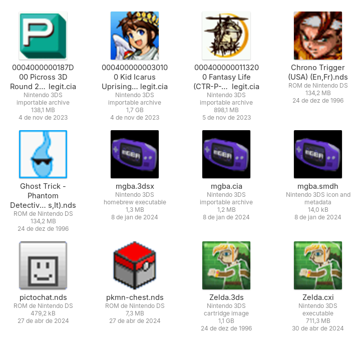

# bign-handheld-thumbnailer



A thumbnailer for Nintendo handheld systems (Nintendo DS and 3DS) roms and files.

This project adheres to the [Freedesktop Thumbnail Managing Standard](https://specifications.freedesktop.org/thumbnail-spec/thumbnail-spec-latest.html).

## Supported files and limitations

* Nintendo DS:
  * NDS roms (.nds extension) - note that DSi animated icons are not supported, the standard DS icon is used instead
* Nintendo 3DS:
  * CIA installer files (.cia extension) - only if Meta section is present and contains a valid SMDH with a valid large icon
  * SMDH metadata files (.smdh extension) - used to be shipped as a separate file for older homebrew but is usually contained inside the more common 3DS file formats and also on newer homebrew
  * 3DSX homebrew files (.3dsx extension) - only if extended header is present and contains a valid SMDH with valid large icon
  * CXI executable files (.cxi extension) - as long as the file is decrypted and it's possible to extract the icon file from the ExeFS
  * CCI cartridge dumps files (the usual roms, .cci extension but more commonly .3ds) - as long it's possible to access the CXI (usually on partition 0) and extract the icon from there (see above, requires a decrypted rom)

## How to install

[](https://repology.org/project/bign-handheld-thumbnailer/versions)

### From COPR (for Fedora)

For users running Fedora 40, 41 or Rawhide (in either Atomic or non-Atomic variants), bign-handheld-thumbnailer has been packaged as a RPM.

The RPMs can be downloaded from the [bign-handheld-thumbnailer COPR](https://copr.fedorainfracloud.org/coprs/mateusrodcosta/bign-handheld-thumbnailer/). For more info on how to install, refer to the COPR description.

### Manual

You will need a Rust development environment and meson installed to
install the binaries and data files:
```
meson setup _build -Dprefix=/usr
ninja -C _build install
```

At this point thumbnails should be working, you likely will want to restart the file explorer or clear the cached thumbnails
