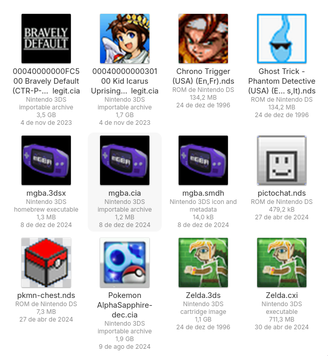

# bign-handheld-thumbnailer



Thumbnailer for Nintendo handheld game consoles (DS and 3DS) roms and homebrew.

This project adheres to the [Freedesktop Thumbnail Managing Standard](https://specifications.freedesktop.org/thumbnail-spec/thumbnail-spec-latest.html).

Licensed under GPLv2+.

## Supported files and limitations

* Nintendo DS:
  * NDS roms and homebrew (.nds) - DSi animated icons are not supported, the normal DS icon is used instead
* Nintendo 3DS:
  * CIA installer files (.cia) - only if Meta section is present and contains a valid SMDH with a valid large icon
  * SMDH metadata files (.smdh) - sometimes shipped separately for older homebrew, usually found inside most 3DS formats including modern homebrew
  * 3DSX homebrew files (.3dsx) - only if extended header is present and contains a valid SMDH with valid large icon
  * CXI executable files (.cxi) - as long as the file is decrypted and it's possible to extract the icon file from the ExeFS
  * CCI cartridge dumps files (.cci, but more commonly .3ds) - as long it's possible to access the contained CXI and extract the icon from there (see above, may require a decrypted rom)

## How to install

[](https://repology.org/project/bign-handheld-thumbnailer/versions)

### Fedora Linux

For users running Fedora Linux 40+, bign-handheld-thumbnailer is available in the official repos as `bign-handheld-thumbnailer`.

### Manual

You will need a Rust development environment and meson installed to
install the binaries and data files:
```
meson setup _build -Dprefix=/usr
ninja -C _build install
```

At this point thumbnails should be working, you likely will want to restart the file explorer (e.g. `nautilus -q`) or clear the cached thumbnails (`rm -R ~/.cache/thumbnails/`).
